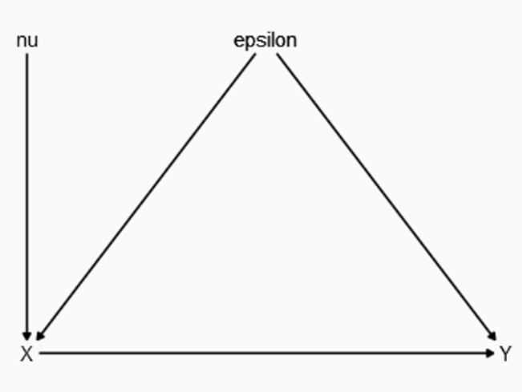

# Introducción a la Regresión lineal


El modelo de regresión es una de las herramientas más utilizadas en econometría y estadística para estimar la media condicional de una variable dependiente en función de un conjunto de variables explicativas. Sin el beneficio de la asignación aleatoria, los estimadores de una regresión podrían no tener una interpretación causal, este concepto se abordará más adelante en el documento. Comenzaremos con las propiedades mecánicas en una regresión. Estas propiedades incluyen la conexión entre la regresión poblacional y la Función de Esperanza Condicional (CEF por sus siglas en inglés). 


# Esperanza Condicional


El concepto de esperanza condicional se basa en la idea de que la distribución de una variable aleatoria \( y \) puede depender de otra variable \( x \). Para ilustrarlo, consideremos el salario de los trabajadores en un país, que puede modelarse como una variable aleatoria _salario_ con una función de distribución \( F(u) = P[\text{salario} \leq u] \). Si \( F \) es diferenciable, entonces su función de densidad de probabilidad está dada por:


$$
    f(u) = \frac{d}{du} F(u).
$$


La esperanza matemática es una medida conveniente de tendencia central, ya que es un operador lineal y se encuentra en muchas aplicaciones económicas. Sin embargo, presenta desventajas, como su sensibilidad a valores extremos de la distribución.

{width=80%}

## Definición de la Esperanza Condicional

¿Es igual la distribución de salario para todos los trabajadores o varía según las subclasificación de la población?  

Para responder esta pregunta y otras similares, podríamos comparar las distribuciones para diferentes grupos, por ejemplo: Hombres y mujeres. 


Es evidente que ambas son similares, pero la correspondiente a los hombres está ligeramente inclinada hacia la derecha. Para simplificar las comparaciones complejas entre distribuciones, podemos utilizar una medida más sencilla: La media o esperanza condicional.   

En nuestro ejemplo, la esperanza condicional del salario dado el género se define como:

\begin{aligned}

    &E[log(salario)|género=hombre]= 3.05  \\

    &E[log(salario)|género=mujer]= 2.81  \\

    &Diferencia = 3.05 -2.81 = 0.24 \\

\end{aligned}


Pero como sabemos existen una multitud de factores además del género que influyen los salarios, por lo que podemos escribir las variables condicionantes (independientes) como vectores en $R^k$:  

$$
x\equiv (x_1 \; x_2 \: x_3... x_k) \; donde\; cada\; i \; es \; una \; variable
$$

Entonces la esperanza condicional de la variable dependiente $y$ dado un vector de $K$ variables independientes $x$ es la media poblacional de$y$ manteniendo fijo los valores de $x$. 

$$
    E[y|x=h]=m(x)
$$

Esto significa que, cuando $x$ toma un valor específico $h$, el valor esperado de $y$ es $m(x)$, lo que se conoce como la **Función de Esperanza Condicional o CEF**.

## Propiedades de la Esperanza Condicional

Podemos descomponer \( y \) como:

$$
    y = E[y | x] + e
$$
donde el término de error \( e \) se define como:

$$
    e = y - E[y | x].
$$
Una propiedad clave es que el error tiene media condicional cero:

$$
    E[e | x] = 0.
$$
Tomamos la esperanza condicional de $x$ a ambos lados de $y = E[y|x] + e$_

$$
E[y|x]=E[E(y|x)+e|x]
$$
Debido a que $E[y|x]$ ya es una función de $x$, se puede tratar como una constante cuando se condiciona en $x$:

$$
E[y|x]=E[y|x]+E[e|x]\\
E[e|x]=0
$$

Adicionalmente, por Ley de Esperanzas Iteradas^[LEI establece que $E[E(y|x)]=E[y]$] también se cumple que:

$$
    E[e] = 0.
$$
Para ver esto, tomamos la esperanza incondicional a ambos lados de $y=E[y|x]+e$:

$$
E[y]=E[E(y|x)]+E[e]\; aplicamos \; LEI\\
E[y]=E[y]+E[e]\\
E[e]=0
$$

## Mejor Predictor en Términos de Mínimos Cuadrados

La función de esperanza condicional $E[y|x]$ es la mejor función en términos de minimizar el error cuadrático medio:

$$
  E[y | x] = \arg \min_{m(x)} E[(y - m(x))^2].
$$
Demostración: 

\begin{align*}
    E[(y - m(x))^2] =&  E\{[(y-E(y|x))-(m(x)-E(y|x))]^2\}\\
    =& E\{[(y-E(y|x))^2+(m(x)-E(y|x))^2]-2(y-E(y|x))(m(x)-E(y|x))\}\\
    =&E[(y-E(y|x))^2]+E[(m(x)-E(y|x))^2]\\
    \geq& E[(y-E(y|x))^2]
\end{align*}

- El término $2(y-E(y|x))(m(x)-E(y|x))$ se simplifica porque $(y-E(y|x)$ es el error condicional en $x$, y por lo demostrado previamente, es ortogonal a cualquier función de $x$.
- El término $E[(y-E(y|x))^2]$ no depende de $m(X)$, por lo que en la minimización va a desaparecer.
- Por tanto, $E[(m(x)-E(y|x))^2]$ se minimiza cuando $m(x)=E(y|x)$

Note cómo aún no hemos definido la forma funcional de $m(x)$.

# Regresión Lineal

Uno de los casos más utilizados es cuando la CEF es lineal en \( x \). En este caso, se escribe como:

\begin{equation}
    m(x) = x'\beta=\beta_0 + \beta_1 x_1 + \beta_2 x_2 + \dots + \beta_k x_k.
\end{equation}

donde:

\begin{equation}
    x = \begin{bmatrix} 1 & x_1 & x_2 & \dots & x_k \end{bmatrix}', \quad
    \beta = \begin{bmatrix} \beta_0 & \beta_1 & \dots & \beta_k \end{bmatrix}.
\end{equation}


## Derivación del Estimador $\beta$

Utilizando la condición de primer orden para minimizar el error cuadrático medio, se obtiene el estimador $\beta$:

\begin{align*}
&\arg \min_{b} E[(y- x'b)^2]\\
&CPO:\\
    &\frac{\delta E[(y-x'\beta)^2]}{\delta \beta}= 2E[x(y-x'\beta)]=0\\
    &\beta= E (x'x)^{-1}E(x'y)
\end{align*}

Para que \(E (x'x)^{-1} \) exista, la matriz \(E( x'x )\) debe ser invertible o no singular, lo que implica que no debe haber colinealidad perfecta entre los regresores.

Considerando el modelo de regresión más simple con $x\equiv(1 \; x_1)$ entonces $m(x)=\beta_0 + \beta_1x_1$.

Los coeficientes: 

\begin{align*}
    \beta_1=\frac{Cov(x_1y)}{Var(x_1)},\; y\\
    \beta_0 =E(y)-\beta_1E(x_1)
\end{align*}


## Supuestos: Regresión Poblacional

Para que el modelo de regresión tenga una interpretación válida, se deben cumplir ciertos supuestos:


  1.**Linealidad**

El modelo debe ser lineal en los parámetros, el término de error debe ingresar de manera aditiva y los coeficientes deben ser constantes para todas las observaciones.

  2.**Exogeneidad**

El término de error \( e \) debe tener esperanza condicional cero:

\begin{align*}
    E(e|x)=&E[(y-m(x))|x]\\
    = &E[y|x]-E[m(x)|x]\\
    =&m(x)-m(x)=0
\end{align*}

Esto implica que los regresores \( x \) no están correlacionados con el error, lo cual es crucial para la interpretación causal del modelo.


# Causalidad vs. Correlación


Supongamos que el proceso generador de datos es:

$$
    X = \gamma_0 + \gamma_1 e + \nu\\
    Y = \beta_0 + \beta_1 X + e
$$

Aquí, \( X \) es afectado por \( e \) y \( \nu \), mientras que \( Y \) es afectado por \( X \) y \( e \). Si bien \( X \) parece afectar \( Y \), la presencia del término \( e \) introduce un problema de endogeneidad.

```{r, echo=FALSE}

```

Para ilustrar esto, consideremos la relación entre salario mínimo y el crecimiento del empleo.   

{width=80%}

[De la página de Mackinac.org](https://www.mackinac.org/a-look-at-what-happens-after-minimum-wage-hikes-in-michigan)

El gráfico muestra la relación entre los cambios en el empleo y los cambios en la proporción de la fuerza laboral que gana el salario mínimo o menos. Parece haber una correlación negativa, ¿podemos interpretar esto diciendo que los salarios mínimos disminuyen el empleo?   

Esta gráfica muestra una **correlación**,  no necesariamente una relación causal, porque esta correlación negativa es consistente con diferentes relaciones causales. El trabajo del econometrista es justamente identificar cual es la correcta!


  1. Una variable omitida que afecta tanto \( X \) como \( Y \).

  2. La dirección de causalidad puede ser opuesta a la asumida.

  3. \( X \) y \( e \) están correlacionados, y es \( e \) el que realmente afecta \( Y \).

Si la opción 3 es la verdadera relación causal, entonces estaríamos viendo una relación espúrea entre el salario mínimo y el empleo. Si la opción 1 es la verdadera (el caso más realista) entonces la existencia de una o varias variables importantes no consideradas que afectan tanto al nivel de salarios como al empleo ocasionan que el efecto directo esté "contaminado". En el ejemplo podríamos pensar en la credibilidad institucional o el tipo de políticas aplicadas.   

Una página interesante para ver relaciones espúreas: [Tyler Vigen](https://tylervigen.com/spurious-correlations) 


